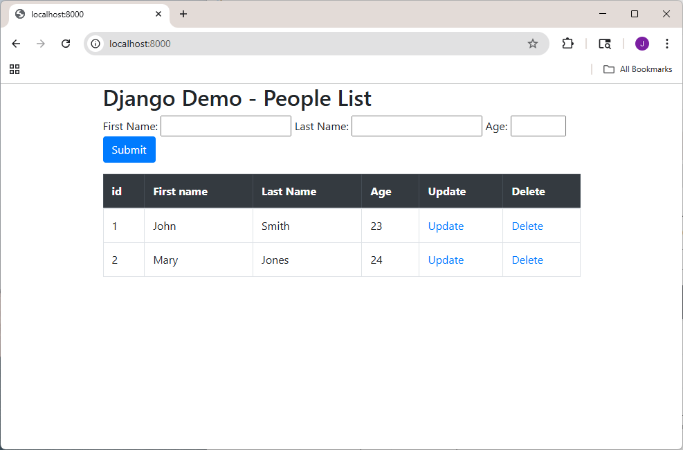

# Django demo project

This is a simple CRUD project using Django. First you need python installed.

Then you go to a directory, create a virtual environment

`python -m venv myworld`

Then activate it

`myworld\Scripts\activate.bat`

Then cd into the environment

`cd myworld`

Install Django

`python -m pip install Django`

Clone this project, so it lives under your myworld folder

Change directory

`cd crud_project`

Create the database with a migration
`python manage.py migrate`

Then run the server
`python manage.py runserver`

Then go to http://localhost:8000 on browser

